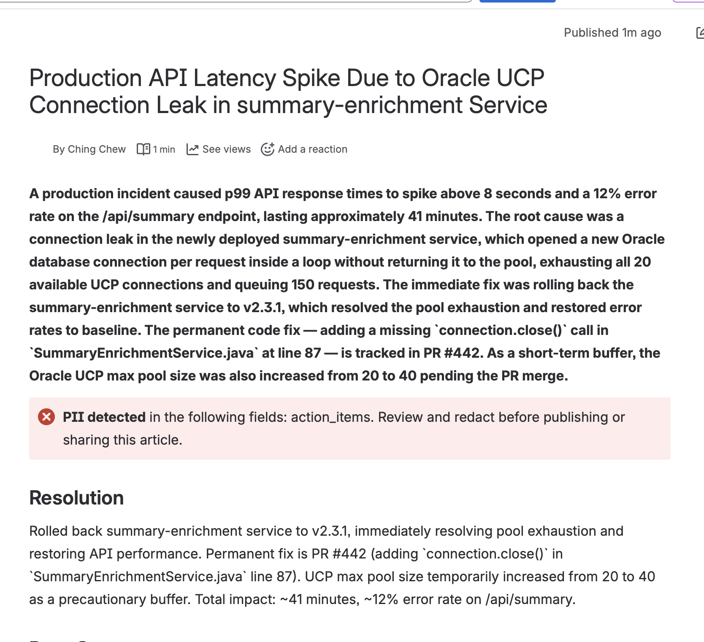

# Documentation Agent

Converts Slack incident threads and Q&A chains into structured Confluence KB articles via a one-click Slack shortcut.



**Localhost flow:** Slack shortcut → ngrok → FastAPI → Claude API (structured extraction) → Confluence page + Slack Block Kit response

**AWS flow:** Slack shortcut → API Gateway → Rust Lambda (HMAC + SQS) → Python worker Lambda → Claude API → DynamoDB + Confluence + Slack response


---

## Version history

| Version | Description |
|---|---|
| v0.2.0 | AWS deployment: Rust API Lambda + Python worker Lambda + SQS + DynamoDB + CDK IaC |
| v0.1.0 | Localhost deployment: FastAPI + ngrok + Claude API (tool use) + Confluence REST API |

---

## Requirements

- Python 3.12+
- [ngrok](https://ngrok.com/) (for local development — exposes FastAPI to Slack webhooks)
- Slack workspace with admin access
- Confluence free tier (personal workspace)
- Anthropic API key
- (AWS deployment only) AWS account, Rust toolchain, cargo-lambda, AWS CDK CLI

---

## Setup

### 1. Python environment

```bash
python3 -m venv .venv
source .venv/bin/activate
pip install -e ".[test]"
```

### 2. Environment variables

```bash
cp .env.example .env
```

Fill in all values in `.env`. See [Slack app setup](#slack-app-setup) and [Confluence setup](#confluence-setup) below for where to find each credential.

### 3. Slack app setup

Create a new Slack app at [api.slack.com/apps](https://api.slack.com/apps).

**OAuth scopes** (Bot Token Scopes under OAuth & Permissions):

| Scope | Purpose |
|---|---|
| `channels:manage` | Create demo channels |
| `channels:read` | List channels |
| `channels:join` | Join channels to post |
| `chat:write` | Post messages |
| `chat:write.public` | Post to channels bot hasn't joined |
| `chat:delete` | Delete demo messages (reset script) |
| `reactions:write` | Add processing indicator |
| `users:read` | Resolve user display names |

**Message shortcut:**

Under Interactivity & Shortcuts → Create New Shortcut → Messages:

| Field | Value |
|---|---|
| Name | Create KB Article |
| Short description | Extract this thread as a KB article |
| Callback ID | `create_kb_article` |

Set the Request URL to your ngrok URL + `/slack/actions` (e.g. `https://your-domain.ngrok-free.app/slack/actions`).

**Credentials to copy to `.env`:**
- Bot User OAuth Token → `SLACK_BOT_TOKEN`
- Basic Information → Signing Secret → `SLACK_SIGNING_SECRET`

Install the app to your workspace and invite the bot to your demo channels.

### 4. Confluence setup

1. Create a free Confluence account at [atlassian.com](https://www.atlassian.com/software/confluence)
2. Create a space for the demo KB (note the Space Key, e.g. `DEMO`)
3. Generate an API token at [id.atlassian.com → Security → API tokens](https://id.atlassian.com/manage-profile/security/api-tokens)

**Credentials to copy to `.env`:**
- `CONFLUENCE_URL` — your site URL, e.g. `https://yourname.atlassian.net/wiki`
- `CONFLUENCE_EMAIL` — your Atlassian account email
- `CONFLUENCE_API_TOKEN` — the token you generated
- `CONFLUENCE_SPACE_KEY` — the space key (e.g. `DEMO`)

---

## Running locally

### Start the API server

```bash
source .venv/bin/activate
uvicorn src.adapters.fastapi_app:app --reload --port 8000
```

### Start ngrok (separate terminal)

```bash
ngrok http 8000
```

Copy the ngrok HTTPS URL and update the Slack shortcut Request URL to `https://<your-ngrok-domain>/slack/actions`.

---

## Demo setup

### Post demo threads to Slack

Posts the 3 sample threads (incident, Q&A, how-to) to your Slack workspace:

```bash
python demo/post-threads.py
```

Creates `#incidents` and `#platform-eng` channels if they don't exist.

### Seed Confluence with a pre-existing article

Creates one article in Confluence before the live demo so the space doesn't look empty:

```bash
python demo/seed-confluence.py
```

### Before the demo

Trigger the ⚡ shortcut on Threads C the day before so the KB space already shows 2 articles (including the one seeded by the script above). During the live demo, trigger the shortcut on Threads A and B so the audience sees the full flow in real time.

### Demo order

1. **Thread A** (`#incidents`) — DB connection pool incident. Most dramatic; run this live.
2. **Thread B** (`#platform-eng`) — Q&A thread. Shows the tool handles different thread types.
3. **Thread C** (`#platform-eng`) — How-to/runbook. Optional if time is short.

### Slides

Open `presentation/slides.html` in a browser for the presentation deck.

---

## Reset

After the demo, restore a clean state:

```bash
# Reset in-memory article store (localhost only — clears stored articles)
python demo/reset-storage.py

# Delete all posted Slack threads
python demo/reset-threads.py

# Delete all Confluence articles in the demo space
python demo/reset-confluence.py
```

---

## Tests

```bash
source .venv/bin/activate
pytest
```

Integration tests (call the Claude API) are marked `integration` and excluded by default:

```bash
pytest -m integration
```

---

## Project structure

```
.
├── src/
│   ├── adapters/
│   │   ├── fastapi_app.py       # FastAPI app — Slack webhook + extract endpoints
│   │   └── aws_lambda_worker.py # Lambda handler for SQS-triggered processing
│   ├── storage/
│   │   ├── base.py              # ArticleStore ABC
│   │   ├── memory.py            # In-memory store (localhost)
│   │   └── aws_dynamodb.py      # DynamoDB store (AWS)
│   ├── extraction/
│   │   ├── extractor.py         # Claude API extraction pipeline
│   │   ├── models.py            # Pydantic KBArticle schema
│   │   └── prompts.py           # System + user prompts
│   ├── pipeline.py              # Cloud-neutral orchestration
│   ├── block_kit.py             # Slack Block Kit response builder
│   ├── confluence_client.py     # Confluence REST API client
│   ├── slack_client.py          # Slack signature verification + thread fetching
│   └── ssm_config.py            # SSM Parameter Store → env var resolution
├── infra/aws/
│   ├── api-lambda/              # Rust Lambda: HMAC verify + SQS enqueue
│   └── cdk/                     # CDK Python stack (SQS, DDB, Lambda, APIGW, alarms)
├── demo/
│   ├── threads/                 # Sample Slack thread transcripts
│   ├── post-threads.py          # Post threads to Slack
│   ├── reset-threads.py         # Delete posted threads
│   ├── reset-storage.py         # Clear in-memory article store
│   ├── seed-confluence.py       # Pre-seed Confluence with one article
│   └── reset-confluence.py      # Delete all Confluence demo pages
├── schema-validation/
│   ├── threads/                 # Raw thread inputs used for extraction testing
│   └── extractions/             # Expected JSON output for each thread
├── tests/
│   ├── conftest.py
│   ├── test_extractor.py
│   ├── test_pipeline.py
│   ├── test_storage_contract.py
│   ├── test_aws_lambda_worker.py
│   ├── test_ssm_config.py
│   └── test_cdk_stack.py
├── DEPLOY.md                    # Full AWS deployment walkthrough
└── presentation/
    ├── slides.html
    ├── screenshots/
    └── diagrams/
```

---

## AWS deployment

See [DEPLOY.md](DEPLOY.md) for the full walkthrough including CDK bootstrap, SSM secret setup, Rust Lambda build, and deploy steps.

---

## Presentation

To convert MARP ([slides-minimal.md](presentation/slides-minimal.md)) to HTML:

```
cd presentation
marp slides-minimal.md -o slides.html
```