<style>
@import url('https://fonts.googleapis.com/css2?family=Inter:wght@300;400;500;600&family=JetBrains+Mono:wght@400&display=swap');

:root {
  --color-background: #ffffff;
  --color-foreground: #1c1c1c;
  --color-heading: #111111;
  --color-muted: #888888;
  --color-rule: #e8e8e8;
  --color-accent: #0066cc;
  --font-default: 'Inter', 'Segoe UI', system-ui, sans-serif;
  --font-mono: 'JetBrains Mono', 'Consolas', monospace;
}

section {
  background-color: var(--color-background);
  color: var(--color-foreground);
  font-family: var(--font-default);
  font-weight: 300;
  box-sizing: border-box;
  padding: 64px 80px 56px;
  font-size: 22px;
  line-height: 1.75;
}

section::after {
  font-size: 13px;
  color: var(--color-muted);
  font-family: var(--font-default);
  font-weight: 300;
}

h1, h2, h3 {
  font-family: var(--font-default);
  margin: 0;
  padding: 0;
  color: var(--color-heading);
}

h1 {
  font-size: 54px;
  font-weight: 300;
  line-height: 1.2;
  letter-spacing: -0.02em;
}

h2 {
  font-size: 36px;
  font-weight: 400;
  letter-spacing: -0.01em;
  margin-bottom: 32px;
  padding-bottom: 16px;
  border-bottom: 1px solid var(--color-rule);
}

h3 {
  font-size: 21px;
  font-weight: 500;
  color: var(--color-accent);
  margin-top: 28px;
  margin-bottom: 8px;
}

ul, ol {
  padding-left: 24px;
  margin: 0;
}

li {
  margin-bottom: 10px;
  color: var(--color-foreground);
}

li strong {
  font-weight: 500;
  color: var(--color-heading);
}

p {
  margin: 0 0 14px;
}

code {
  font-family: var(--font-mono);
  font-size: 0.85em;
  background-color: #f4f4f4;
  color: #333;
  padding: 2px 7px;
  border-radius: 3px;
}

pre {
  background-color: #f6f8fa;
  border: 1px solid var(--color-rule);
  border-radius: 4px;
  padding: 16px;
  font-family: var(--font-mono);
  font-size: 24px;
  line-height: 1.5;
}

pre code {
  background: none;
  padding: 0;
  border-radius: 0;
}

table {
  width: 100%;
  border-collapse: collapse;
  font-size: 0.88em;
  font-weight: 300;
  margin-top: 8px;
}

th {
  font-weight: 500;
  font-size: 0.85em;
  color: var(--color-muted);
  text-transform: uppercase;
  letter-spacing: 0.05em;
  padding: 8px 14px;
  border-bottom: 1px solid var(--color-rule);
  text-align: left;
}

td {
  padding: 10px 14px;
  border-bottom: 1px solid var(--color-rule);
  vertical-align: top;
}

/* Title / lead slide */
section.lead {
  display: flex;
  flex-direction: column;
  justify-content: center;
  padding: 80px;
  border-left: 3px solid var(--color-heading);
}

section.lead h1 {
  font-size: 58px;
  font-weight: 300;
  letter-spacing: -0.03em;
  margin-bottom: 24px;
  line-height: 1.15;
}

section.lead p {
  font-size: 20px;
  color: var(--color-muted);
  font-weight: 300;
  margin: 0;
  line-height: 1.6;
}

/* Section break slides */
section.break {
  display: flex;
  flex-direction: column;
  justify-content: center;
  padding: 80px;
  background-color: var(--color-heading);
  color: #ffffff;
}

section.break h1 {
  font-size: 48px;
  font-weight: 300;
  color: #ffffff;
  letter-spacing: -0.02em;
  margin-bottom: 16px;
}

section.break p {
  font-size: 20px;
  color: rgba(255,255,255,0.55);
  margin: 0;
}

/* Appendix */
section.appendix h2 {
  color: var(--color-muted);
  font-size: 28px;
  border-bottom-color: #eeeeee;
}

/* Inline note / callout */
.note {
  border-left: 2px solid var(--color-rule);
  padding-left: 20px;
  color: var(--color-muted);
  font-size: 0.9em;
  margin-top: 20px;
}

/* Definition callout used in architecture slides */
.def {
  border-left: 3px solid var(--color-accent);
  padding: 10px 18px;
  background: #f0f6ff;
  border-radius: 0 4px 4px 0;
  margin: 16px 0;
  font-size: 0.88em;
  color: var(--color-foreground);
}

/* Screenshot placeholder */
.ph {
  background: #e8e8e8;
  border-radius: 6px;
  display: flex;
  align-items: center;
  justify-content: center;
  padding: 24px;
  color: #777;
  font-size: 15px;
  text-align: center;
  font-family: var(--font-mono);
}
</style>

<!-- _class: lead -->
<!-- _paginate: false -->

# From Slack Thread to Knowledge Base Article: Building and Deploying an AI Documentation Agent on AWS
<br/>

One click. Any Slack thread. A Confluence article.

Ching Chew · AWS Canberra User Group · June 2026

<br/>


<!-- note:
Pre-show: Confluence open with seeded article, Slack open with incident thread, AWS stack running.

Ask audience: study/just finished, "would you consider yourself technical" and if you are new to AWS (~3 months or less).

Presentation for beginners and experts. I will show you a demo of how the solution works, introduce the AWS components used and the commands to run this tonight on localhost or AWS.

Scan the QR if you want to follow along or start running.
-->

---

## Who I Am

- 27 years in IT, ~20 years in federal government
- Full Stack Developer at the Department of Health, Disability and Ageing
- Primary stack: Vue.js, Java, Python, AWS

<br/>

The constant across every organisation I have worked in:

**"We need to document this better."**

And yet.

<!-- note:
Knowledge creation, capture and use is something that I am passionate about.
-->

---

## The Problem

A technical expert resigns and takes 5 years of context with them.

- Their knowledge lived in Slack threads and direct messages
- Incident writeup happened when someone remembered
- Same incident, six months later: no playbook in sight

**What did your organisation actually capture?**

<!-- note:
Informal survey that I did: people ask questions in collaborative messaging apps and they collaborate on incidents/problems in those apps too.

Personal exeperience: current role, Tech Lead resigned 2 months in. Thankfully could get part-timer and existing knowledge in team to help with major release.

Can you think of your own situation?

This presentation focuses on technical role, but can also happen in policy, HR, operations, manufacturing, academic etc.

IDC 2026: $31b loss in Fortune 500. Another study claims knowledge worker ~20% time spent searching for information.
-->

---

## Why This Keeps Happening

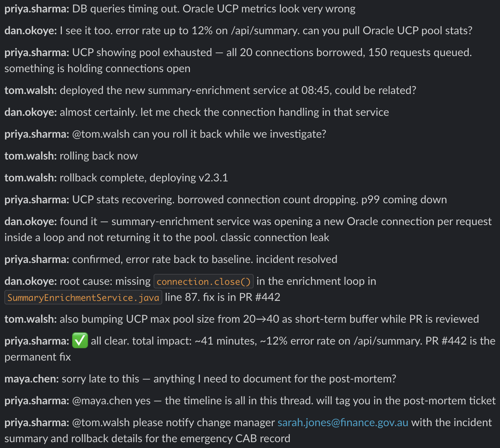

The issue is not motivation, it is timing+friction.

- Incident resolves at 11pm
- Everyone moves on by morning
- Write-up happens if someone remembers
- Invisible in Slack if you weren't there

The knowledge existed at thread close. 

**That was the window.**

<!-- note:
"Your teams aren't failing to document. They're failing to beat the friction in the moment."
-->

---

<!-- _paginate: false -->

# What if all it takes is one click?

---

<!-- _paginate: false -->


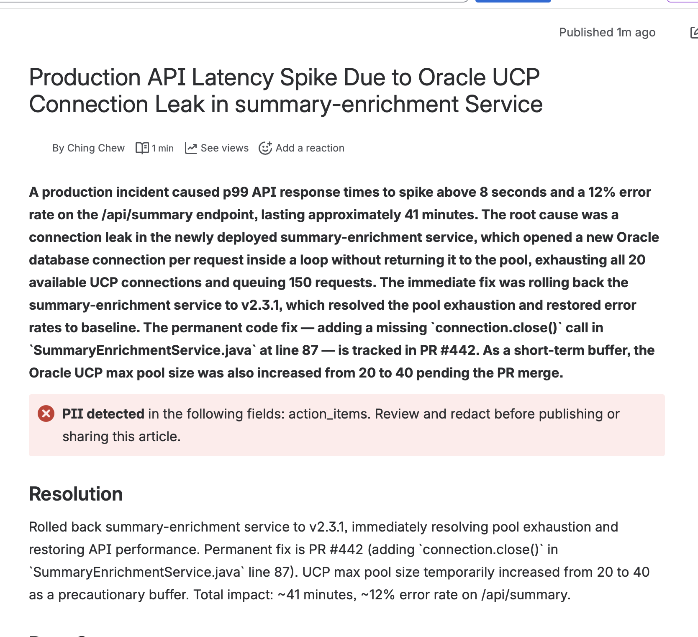

<!-- note:
Full-bleed split. No narration needed. Let the gap do the work.
"That's the Slack thread. That's the Confluence article. One click."
-->
---

<!-- _class: break -->
<!-- _paginate: false -->

# Live Demo

Scenario A: Incident Thread

<!-- note:
1. Show Confluence (seeded article visible)
2. Open Slack thread (DB connection pool incident)
3. ⚡ → "Create KB Article"
4. Pause. This is the async pattern working.
5. Block Kit response: PII warning for sarah.jones@finance.gov.au
6. Switch to Confluence (generated article live)
Backup recording ready if live demo fails.
-->

---

## How It Works

Five AWS components, one pipeline:


Each component does one job. Together they handle KB creation from Slack thread.

<!-- note:
Walk the diagram left to right. Each component exists because of a specific constraint.
Slack: 3-second timeout forces async. SQS: decouples acknowledgement from extraction. Rust: HMAC is CPU-bound. Python Lambda: slow AI work happens here, away from the timer. DynamoDB: audit trail for every run.

Restaurant analogy of async request-reply (ACK): front of house takes order (Rust Lambda), orders are added to check rail/ticket holder (SQS), food gets prepared (Lambda/Python).
-->

---

## Step 1: Slack Shortcut

The trigger. A shortcut item added to any Slack message.

- No new tool if your team already uses Slack
- User clicks ⚡ → "Create KB Article" on any thread
- Slack fires a webhook to an HTTP endpoint

<br/>

**Pipeline:**

`Slack ⚡` → ...

<!-- note:
The shortcut is configured once in api.slack.com/apps. Teams never change their workflow. The tool comes to where the knowledge already lives.
-->

---

## Step 2: API Gateway + Rust Lambda

The front door.

<div class="def"><strong>API Gateway</strong>: AWS's managed HTTP entry point; receives the Slack webhook</div>
<div class="def"><strong>Rust Lambda</strong>: a Lambda function written in Rust; used here for fast HMAC signature verification</div>
<div class="def"><strong>HMAC</strong>: a cryptographic signature check; verifies the request genuinely came from Slack</div>

Slack demands a HTTP status code `200 OK` within 3 seconds. 

Rust completes verification before other languages (e.g. Python) complete cold startup.

**Pipeline:** `Slack ⚡` → `API Gateway` → `Rust Lambda` → ...

<!-- note:
A few months ago Brian presented his team's experience moving to Rust.

Why Rust for HMAC: Python cold start + HMAC computation was pushing against Slack's 3-second window in testing. Rust at 128MB hits the acknowledgement before Slack even starts its retry timer.
-->

---

## Step 3: SQS

The queue.

<div class="def"><strong>SQS (Simple Queue Service)</strong>: AWS's managed message queue; decouples webhook receiver from extraction worker</div>

- Rust Lambda acknowledges Slack in &lt;1s, enqueues the job
- Extraction can take 10-15 seconds (longer with v0.3 KB updates)
- If the worker fails, the message retries automatically (DLQ after 3 attempts)

**Pipeline:** `Slack ⚡` → `API Gateway` → `Rust Lambda` → `SQS` → ...

<!-- note:
This is the architectural decision that makes the whole thing reliable. Without the queue, any extraction timeout would cause Slack to retry the webhook and create duplicate articles.
-->

---

## Step 4: Python Lambda + Claude API

The brain.

<div class="def"><strong>Claude API</strong>: Anthropic's AI API; handles the extraction and structuring</div>
<div class="def"><strong>Tool use</strong>: a Claude API feature that fills a typed data schema instead of returning freeform text</div>
<div class="def"><strong>Pydantic</strong>: a Python library for data validation and typed schemas</div>

The worker pulls the job from SQS, sends the thread text to Claude API, and receives a structured Pydantic object back. No parsing, no regex.

**Pipeline:** `Slack ⚡` → `API Gateway` → `Rust Lambda` → `SQS` → `Python Lambda + Claude API` → ...


<!-- note:
Schema good for consistency so that LLM doesn't reinvent KB format/structure each time it does the extraction.
-->

---

## Step 5: Outputs

The destinations.

<div class="def"><strong>DynamoDB</strong>: AWS's serverless NoSQL database; stores article metadata and run logs</div>

- Article written to Confluence under the configured parent page
- Metadata (article ID, confidence score, PII flags) persisted to DynamoDB
- Block Kit notification posted back to the original Slack thread

**Complete pipeline:**

`Slack ⚡` → `API Gateway` → `Rust Lambda` → `SQS` → `Python Lambda + Claude API` → `DynamoDB + Confluence + Slack`

<!-- note:
The Slack response closes the loop. The user who triggered it gets a link to the article without leaving their thread.

Let's look at the AWS Console for each component so that you know what to look for when you deploy the solution.
-->

---

## AWS Console: API Gateway

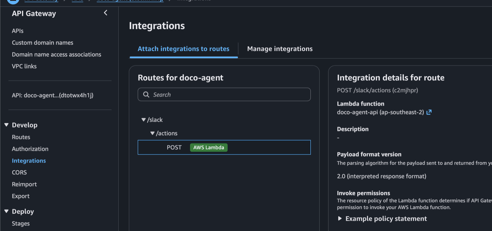

<div class="note">One HTTP API. One route. The invoke URL goes directly into the Slack app configuration.</div>

---

## AWS Console: Rust Lambda

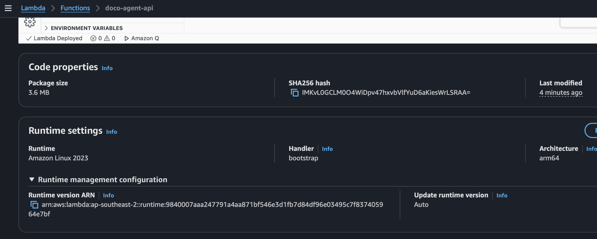

**Why Rust here:** HMAC verification is CPU-bound and synchronous. Rust at 128MB cold-starts faster than Python at 512MB and completes the check before Slack's retry timer fires.

<!-- note:
Rust Lambda built as Docker image so you won't be able to see the .rs code on AWS Console.
-->

---

## AWS Console: SQS

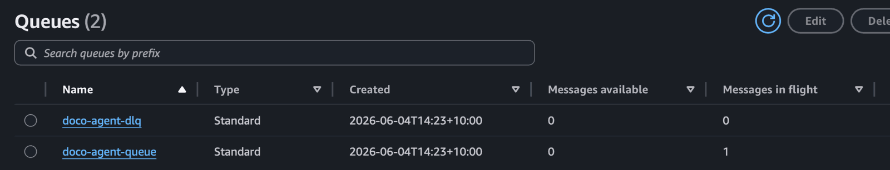

**Why SQS here:** the verifier must respond in under 3 seconds; the worker can run up to 5 minutes. The queue decouples them cleanly without any custom retry logic.

<!-- note:
DLQ is dead letter queue.
-->

---

## AWS Console: Python Lambda

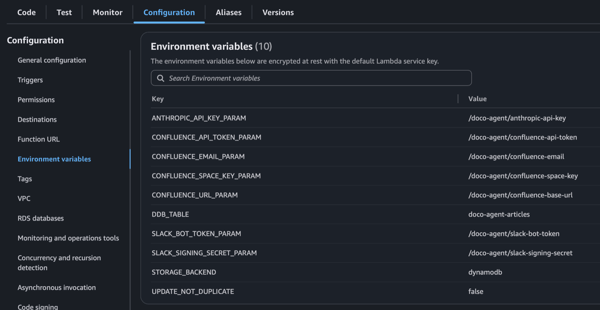

**Secrets in SSM Parameter Store.** Fetched at cold start, never stored in environment variables or code. The env var holds the parameter *name*, not the value.

<!-- note:
If you update parameter value, need to reload Lambda.
-->

---

## AWS Console: DynamoDB

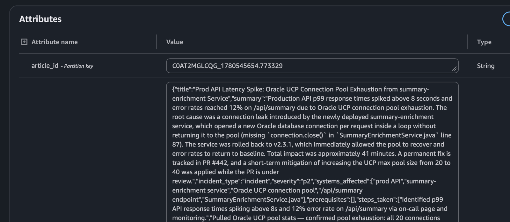

**Why DynamoDB:** serverless, no schema migration, pay-per-request pricing is near-zero for demo workloads. Stores article metadata and every extraction run log.

<!-- note:
LLM extracts and structures Slack thread as JSON, stored without need for further translation.
-->

---

## CDK: Infrastructure as Code

<style scoped>
pre { font-size: 15px; line-height: 1.45; }
</style>

```python
# infra/aws/cdk/doco_agent_stack.py: SQS + Lambda wiring
queue = sqs.Queue(self, "DocoAgentQueue",
    queue_name="doco-agent-queue",
    visibility_timeout=Duration.minutes(6),
    dead_letter_queue=sqs.DeadLetterQueue(
        max_receive_count=3, queue=self.dlq),
)

worker_fn = lambda_.Function(self, "DocoAgentWorker",
    function_name="doco-agent-worker",
    runtime=lambda_.Runtime.PYTHON_3_11,
    architecture=lambda_.Architecture.ARM_64,
    handler="src.adapters.aws_lambda_worker.handler",
    timeout=Duration.minutes(5),
)

worker_fn.add_event_source(
    lambda_events.SqsEventSource(queue, batch_size=1)
)
```

**Why CDK over ClickOps:** reproducible, version-controlled, teardown is `cdk destroy`. 
The whole stack is ~240 lines including alarms, IAM and budgets.

<!-- note:
CDK = Cloud Development Kit. Defines all AWS infrastructure as Python code. Not YAML, not JSON.
-->

---

## The Bigger Pattern


The same pipeline works for any structured conversation: email chains, meeting notes, support tickets.

The architecture does not change. Only the schema and the prompt.

<!-- note:
"So what" moment. Seed the question: what conversation-based workflows exist in your organisation right now?
-->

---

## Get Started Tonight

No AWS account required for the first run (there is AWS Free Tier if you want to deploy to AWS).

<style scoped>
pre { font-size: 18px; }
</style>

```bash
git clone https://github.com/cchew/documentation-agent
cd documentation-agent
python3 -m venv .venv && source .venv/bin/activate
pip install -e ".[test]"
cp .env.example .env          # Slack + Confluence + Anthropic keys
uvicorn src.adapters.fastapi_app:app --reload --port 8000
```

- Anthropic API: free trial credits at console.anthropic.com
- Confluence: free tier at atlassian.com (personal space)
- Slack: any workspace you can install apps into

Full AWS stack: follow `README.md` (details in `DEPLOY.md`). CDK deploy takes about 3 minutes.

<!-- note:
Only verified on MacOS. Ping me if you encounter issues on Windows.

Ping me if you want some Anthropic credits.
-->

---

## Conclusion

"You do not rise to the level of your goals. You fall to the level of your systems."
- James Clear, *Atomic Habits*

<br/>

- Low friction way to capture corporate knowledge
- Extend this to your organisation's collaborative messaging and wiki tools
- Build the system. The habit follows.

<br/>

- Thank you for your time
- DM me on LinkedIn with your feedback and suggestions

<!-- note:
AWS UG close. Leave them with the architectural lesson, not just the demo.
The async pattern and the right-tool principle are the takeaways that transfer beyond this project.
-->

---

<!-- _class: appendix -->
<!-- _paginate: false -->

## Appendix A: Slack App Setup

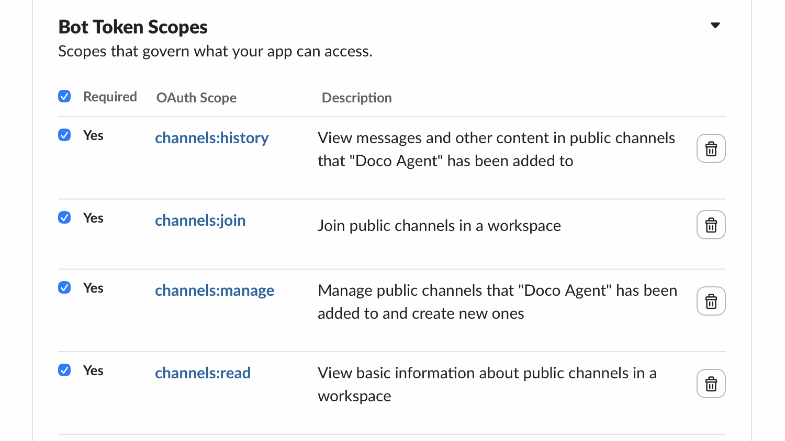

See `README.md` for required OAuth scopes.

Configure the message shortcut: Features → Shortcuts → Create a shortcut → On messages. 

Set callback ID to `create_kb_article`.

---

<!-- _class: appendix -->
<!-- _paginate: false -->

## Appendix B: Slack Webhook URL

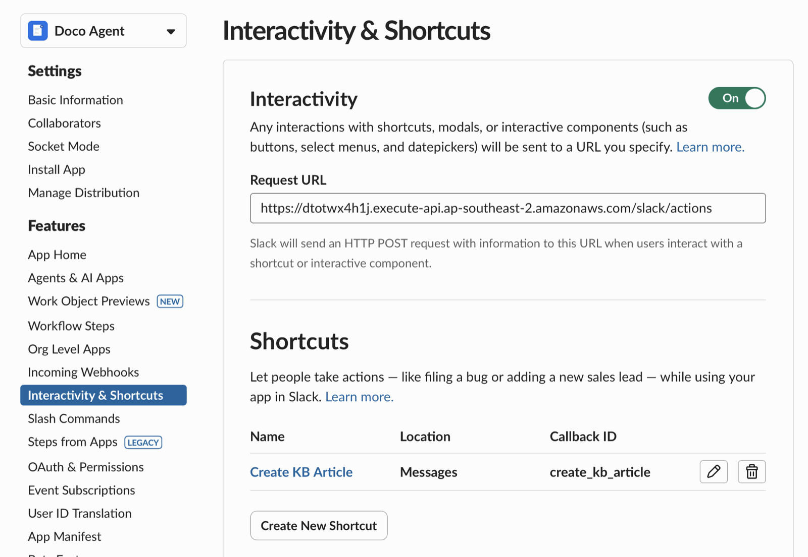

<div class="note">Both fields take the same endpoint: localhost (ngrok URL + /slack/actions), AWS (API Gateway invoke URL + /slack/actions)</div>

---

<!-- _class: appendix -->
<!-- _paginate: false -->

## Appendix C: Confluence Setup

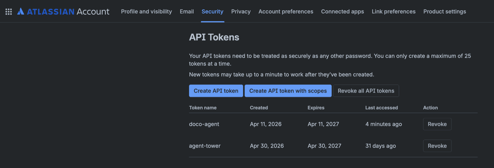

Set `CONFLUENCE_URL`, `CONFLUENCE_EMAIL`, `CONFLUENCE_API_TOKEN`, `CONFLUENCE_SPACE_KEY`, and `CONFLUENCE_PARENT_PAGE_ID` in `.env` (localhost) or SSM Parameter Store (AWS).

---

<!-- _class: appendix -->
<!-- _paginate: false -->

## Appendix D: Production Considerations

**Quality and governance**
- Confidence score &lt; 0.6: article goes to draft, not published
- Human review before articles are visible org-wide
- `prompt_version` logged with every extraction. Treat prompt changes like code

**Data residency**
- Thread text sent to Claude API, not retained beyond the request
- Above OFFICIAL sensitivity: self-hosted (Ollama) or sovereign-region (Azure OpenAI in Australia East)

**Scalability**
- Demo: DynamoDB + SQS already production-grade at this scale
- Eval pipeline: schema validation today; LLM-as-judge for production regression

---

<!-- _class: appendix -->
<!-- _paginate: false -->

## Appendix E: Demo Backup (1/3) — Slack Shortcut

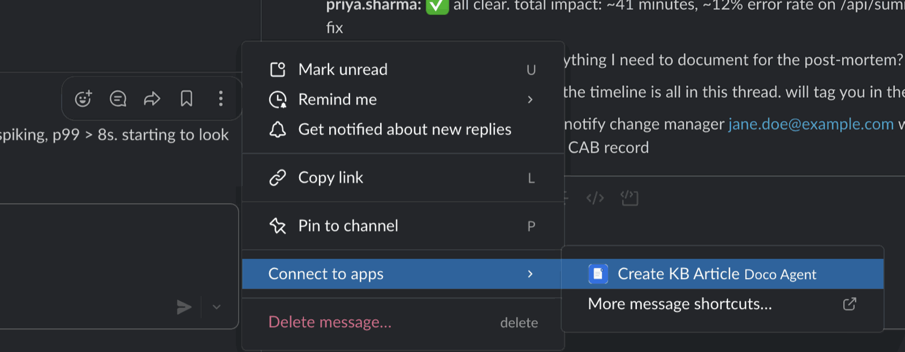

<div class="note">User triggers the shortcut on the incident thread: ⚡ → "Create KB Article".</div>

---

<!-- _class: appendix -->
<!-- _paginate: false -->

## Appendix E: Demo Backup (2/3) — Acknowledgement

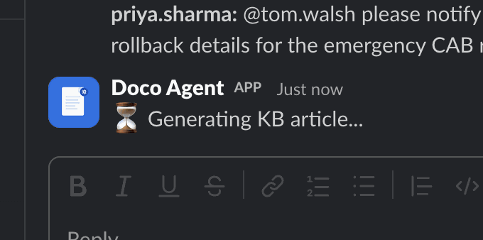

<div class="note">Sub-second ack posted back into the thread while the worker runs asynchronously.</div>

---

<!-- _class: appendix -->
<!-- _paginate: false -->

## Appendix E: Demo Backup (3/3) — Article Created

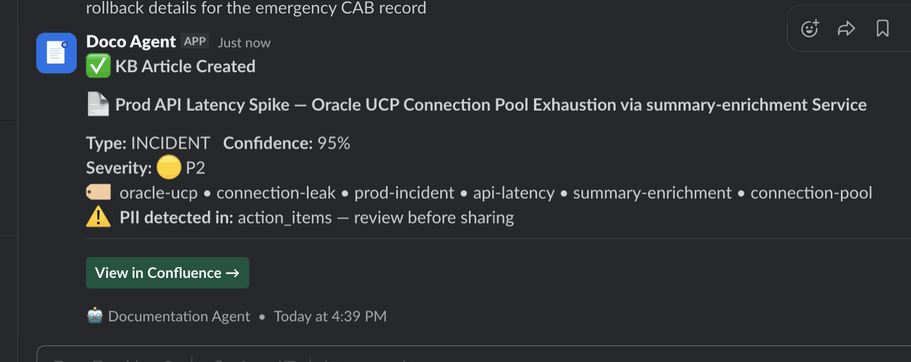

<div class="note">Block Kit confirmation with article link, confidence score, and PII flags.</div>
