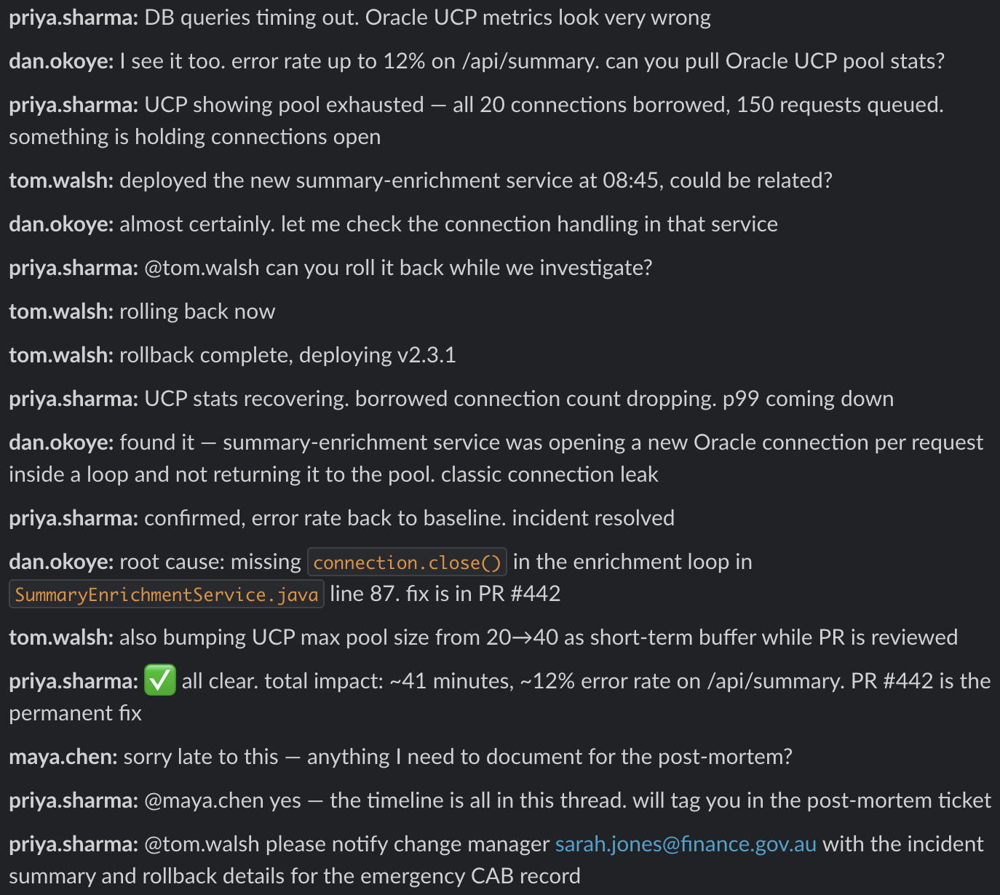

<!-- _class: lead -->
<!-- _paginate: false -->

# Easy Corporate Knowledge Capture

 
One click. One article. Zero documentation overhead.

Ching Chew · April 2026

 

<!-- note:
Pre-show: Confluence open with seeded article, Slack open with DB connection pool thread, ngrok + FastAPI running.

Ask: when issues happen, how do you reach out to others? 
=> Email, phone calls, service desk ticket?
What about when you are working to solve issues?
=> In person meetings, conference calls?

Today a lot of us use team collaboration and messaging platforms like Teams, Slack etc.
=> However, this brings problems.
-->

---

## The Knowledge Drain

An engineer with 5 years just resigned.

- Knowledge lived in team message threads and DMs
- Incident write-ups happen if someone remembered
- Same incident, six months later, no playbook
 

**What did your organisation actually capture?**

<!-- note:
Open with the scenario. Don't answer the question — let it sit.
Every person in the room should think of a real example from their org.
-->

---

## Why This Keeps Happening

- Incident resolves at 11pm
- Everyone moves on by morning
- Write-up happens if someone remembers
- Invisible in Slack if you weren't there

The knowledge existed at thread close. 

**That was the window.**

<!-- note:
Screenshot: messy Slack thread, resolution buried in the middle.
"This is the thread where the knowledge lives. Right now."
4th bullet point is a key issue: it is invisible to organisation.

Q: How many people search Teams to find the solution for a recurring problem?
-->

---

# One Click

--- 

<!-- note:
Full-bleed split. No narration needed. Let the gap do the work.
"That's the Slack thread. That's the Confluence article. One click."
-->

---

<!-- _class: break -->
<!-- _paginate: false -->

# Live Demo

Scenario A - Incident Thread

<!-- note:
1. Show Confluence — existing article visible
2. Show Slack thread
3. ⚡ → "Create KB Article"
4. Note the pause — async pattern
5. Block Kit response: PII warning for sarah.jones@finance.gov.au
6. Switch to Confluence — generated article live
-->

---

## How It Works

Five components:

Connects tools your teams already have.

<!-- note:
For execs: "connects tools you already have."
For devs: Slack demands 200 in 3 seconds. Extraction takes 5-10s. FastAPI background tasks solve this.
Teams (ADO Wiki/SharePoint): same architecture, different SDKs. 5-second timeout.

HTTPS
Slack App - Message shortcut triggers a webhook
FastAPI - Acknowledges in <1s, runs extraction async
Claude API - Extracts structured KB article via tool use
Confluence API - Creates formatted KB page
Slack API - Posts Block Kit result back to thread
-->

---

## Key Technical Decisions

### Tool use → structured output
- Model fills a typed Pydantic schema
- No parsing, no regex, no post-processing

### Async background task
- Slack demands a 200 response in 3 seconds
- Extraction takes 5–10 seconds
- FastAPI acknowledges, runs async, posts result back

### PII detection in-prompt
- Single pass returns `pii_detected` and `pii_fields`
- Warning in Slack and Confluence 

<!-- note:
Decision #3 was live in the demo — sarah.jones@finance.gov.au triggered the PII flag.
For execs: human-in-the-loop on PII is the governance story.
For devs: PII is prompt-based — no separate model, no extra API call.

- Consistent and auditable on every run
-->

---

<!-- _class: break -->
<!-- _paginate: false -->

# Live Demo

Scenario B — Q&A Thread

<!-- note:
Faster — audience already understands the flow.
Q&A thread shows the schema generalises beyond incidents.
No PII this time — clean result.
Confluence now has a second article accumulating.

We can keep going, but you get the idea.
-->

---

## Lessons Learnt

- Slack and Confluence setup took the longest
- The 3-second timeout was the real problem
- Confidence scoring is prompt-based, not production-grade
- Eval framework is manual — needs a proper pipeline

<!-- note:
"I'm showing you a pattern and being straight about where it ends."

Teams adaptation: same architecture, different SDKs. Adaptive Cards. 5-second timeout.
-->

---

## The Bigger Pattern

The same pipeline can also apply to:

- Email chains and approval decisions
- Meeting notes and action items
- Support tickets and help desk logs

<!-- note:
The talk is about the pattern as much as the tool.

"So what" moment for executives.
Seed the question: "What conversation-based workflows exist in your organisation right now?"
-->

---

## How Claude Built This

The demo was built using the same AI it demonstrates.

- Backend scaffolded by Claude Code in one session
- Slack thread scenarios generated by Claude
- Extraction prompt iterated against test cases
- PII test case added mid-build, verified live

Claude handled the boilerplate. Product decisions were human calls. That is repeatable.

<!-- note:
Most credible slide in the deck for developers.
For executives: "This is how AI-assisted development works. Not magic — leverage."
-->

---

## Conclusion

"You do not rise to the level of your goals. You fall to the level of your systems."
— James Clear, Atomic Habits
 
- Your teams aren't failing to document. They're failing to beat the friction in the moment.
- Build the system. The habit follows.
 
- Thank you for your time
- Feedback and comments – DM me via Teams or LinkedIn.

<!-- note:
"Atomic Habits says habits form when friction disappears."

BJ Fog - Tiny Habits
-->
---

<!-- _class: appendix -->
<!-- _paginate: false -->

## Appendix A — Production Considerations

**Quality and governance**
- Confidence score threshold — below 0.6, articles go to draft
- Human review before articles are visible org-wide
- Corrections feed back into the golden dataset - use autoresearch for prompt refinement

**Prompt stability**
- Version-pin the system prompt; log `prompt_version` with each extraction
- Treat prompt changes like code — test before promoting

**Data residency**
- Thread text sent to Claude API, not retained beyond request
- Above OFFICIAL sensitivity: self-hosted model (Ollama, Azure-hosted)

<!-- note:
Cover only if time permits or directly asked.
Governance and data residency are the questions executives will ask.

**Scalability**
- Demo: SQLite. Production: audit trail + task queue (Celery, SQS)
-->

---

<!-- _class: appendix -->
<!-- _paginate: false -->

## Appendix B — Eval Framework Options

| Approach | What it catches | Effort |
|----------|----------------|--------|
| Schema validation | Format failures | Already in place |
| Golden dataset + manual diff | Semantic quality | Low — best first step |
| LLM-as-judge | Semantic failures at scale | Medium |
| Promptfoo | Regression on prompt changes | Medium, CI-integrated |
| Braintrust | Production prompt drift | Medium–High |

**Recommendation**
- Demo: schema validation + golden dataset
- Production: LLM-as-judge + Promptfoo or Braintrust

<!-- note:
LLM-as-judge risk: bias toward plausible-sounding but wrong outputs. Acknowledge if raised.
-->
